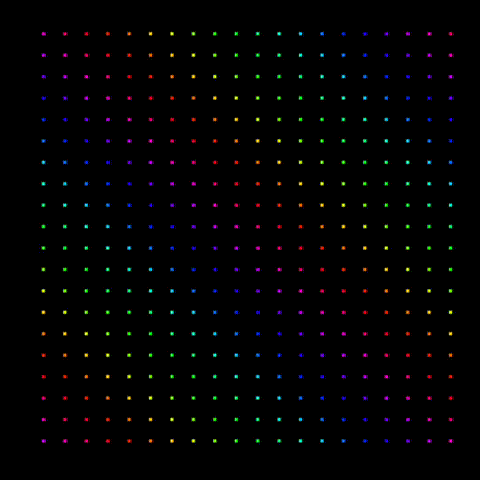

# GoLEDz

GoLEDz is a Go-based backend for controlling LEDs. It also includes a web-based visualizer for viewing patterns in development, without the need for a physical device.

# Visualizer

The visualizer allows you to preview patterns on a development device through a browser.



It is currently recommended to use FireFox or Safari, as the current method for drawing to a canvas is VERY slow in Chrome.

# Development

## Dependencies

The backend depends on Go, which can be downloaded and installed from [here](https://go.dev/doc/install).

While the visualizer is written in vanilla JS, the dev environement uses Vite, which depends on [NPM](https://docs.npmjs.com/downloading-and-installing-node-js-and-npm). 

## Setup

Install all of the backend dependencies:
```
$ cd backend
$ go get .
```

Install all of the visualizer dependencies:
```
$ cd visualizer
$ npm install
```

## Running the project
To run the project, first navigate into the `backend`, then run the go project:

```
$ cd backend
$ go run .
```

To run the visualizer, navigate to the `vizualizer` directory and run the Vite dev server:

```
$ cd visualizer
$ npm run dev
```

## Live Reload

To enable live reload upon changes to the backend code, [air](https://github.com/cosmtrek/air) is recommended.

To install:
```
$ go install github.com/cosmtrek/air@latest
```

To run:
```
$ cd backend
$ air
```